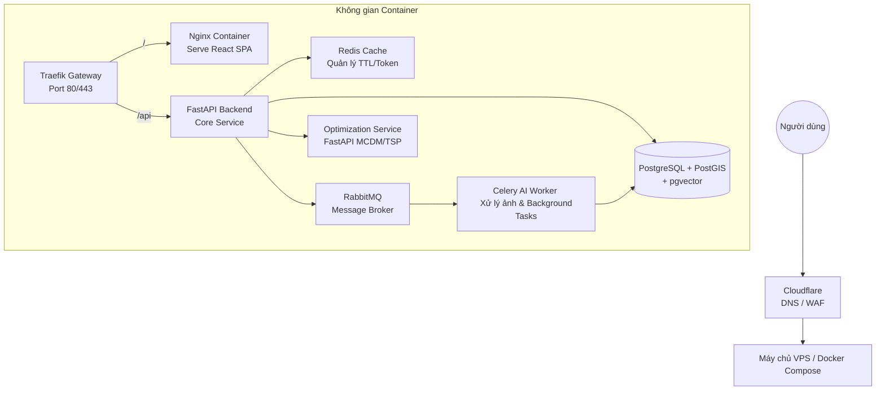

# Hướng dẫn tạo lại sơ đồ trên Draw.io

Để chèn các sơ đồ này vào Draw.io và tô màu, bạn làm theo các bước sau:
1. Mở trang web [Draw.io](https://app.diagrams.net/).
2. Trên thanh menu, chọn **Arrange > Insert > Advanced > Mermaid...** (Hoặc dấu cộng `+` trên thanh công cụ -> Advanced -> Mermaid).
3. Copy từng đoạn mã Mermaid dưới đây dán vào hộp thoại.
4. Nhấn **Insert**. Sơ đồ sẽ xuất hiện và bạn có thể bấm vào từng khối để tự do tô màu, sau đó xuất ra file `.png` (File > Export as > PNG) để đè vào thư mục `1705/images/` trong dự án.

---

### 1. Thay thế cho `images/x.png` (Hình 1: Sơ đồ khái quát quy trình hệ thống)

```text
graph TD
    A[Người dùng / Du khách] -->|Khám phá| B(Bản đồ du lịch O2O)
    B --> C{Lọc theo nhu cầu}
    
    C -->|Smart Planner| D[Lộ trình tối ưu]
    C -->|Visual Search| E[Tìm kiếm bằng ảnh]
    C -->|AI Assistant| F[Thông tin văn hóa]
    
    D --> G(Tham quan & Mua sắm tại điểm đến)
    E --> G
    F --> G
    
    G --> H[Chọn sản phẩm]
    H --> I[Đặt giữ hàng / Soft-Lock]
    
    I --> J{Thanh toán VietQR}
    J -->|Thành công| K[Xác nhận trừ tồn kho]
    J -->|Thất bại/Quá hạn| L[Hoàn trả tồn kho]
    
    K --> M[Nhận hàng tại điểm đến]
```

---

### 2. Thay thế cho `images/a.png` (Hình 3: Kiểm soát đồng thời Phần 1)
*(Dựa theo file backend/app/domains/inventory/service.py)*

```text
graph TD
    Start((Bắt đầu)) --> Req1[Yêu cầu Lock sản phẩm]
    Req1 --> DB_Lock[SELECT FOR UPDATE dòng tồn kho]
    DB_Lock --> Check1{Tồn kho khả dụng <br/> > Số lượng yêu cầu?}
    
    Check1 -->|Không| Err1[Báo lỗi: Không đủ hàng]
    Check1 -->|Có| Update1[Cộng thêm vào locked_stock]
    Update1 --> Insert1[Tạo bản ghi InventoryLock <br/> trạng thái soft_locked]
    Insert1 --> Redis[Lưu TTL 15 phút vào Redis]
    Redis --> End1((Giữ hàng <br/>thành công))
    
    End1 --> Req2[Yêu cầu Thanh toán / Checkout]
    Req2 --> Check2{Lock còn hạn <br/> & Đúng User?}
    Check2 -->|Không| Err2[Báo lỗi: Lock không hợp lệ]
    Check2 -->|Có| DB_Lock2[SELECT FOR UPDATE kho hàng]
    DB_Lock2 --> Check3{Tồn kho thực tế <br/> > Số lượng?}
    
    Check3 -->|Không| Err3[Báo lỗi: Tồn kho lỗi]
    Check3 -->|Có| Update2[Đổi trạng thái Lock <br/> thành checkout_pending]
    Update2 --> Order[Tạo đơn hàng PENDING_PAYMENT]
    Order --> End2((Trả về URL VietQR <br/> Chờ Webhook Ngân hàng))
```

---

### 3. Thay thế cho `images/c.png` (Hình 4: Kiểm soát đồng thời Phần 2)

```text
graph TD
    subgraph Nhánh Webhook Ngân Hàng
    Webhook((Nhận Webhook)) --> Verify[Xác thực chữ ký HMAC]
    Verify --> Check1{Thành công?}
    Check1 -->|Không| Reject[Từ chối request HTTP 401]
    Check1 -->|Có| DB_Lock[SELECT FOR UPDATE <br/> Order & InventoryLock]
    DB_Lock --> Check2{Trạng thái thanh toán?}
    
    Check2 -->|PAID| Success[Trừ stock <br/> Trừ locked_stock]
    Check2 -->|FAILED| Fail[Hoàn trả locked_stock]
    
    Success --> Update1[Cập nhật Order = PAID <br/> Lock = completed]
    Fail --> Update2[Cập nhật Order = FAILED <br/> Lock = failed]
    end
    
    subgraph Nhánh Tác Vụ Nền (Celery Beat)
    Beat((Worker quét <br/> mỗi 1 phút)) --> Sweep[Tìm Lock có expires_at < now]
    Sweep --> LockRows[SELECT FOR UPDATE SKIP LOCKED]
    LockRows --> Iterate{Duyệt từng <br/> Lock?}
    Iterate -->|Có| Release[Trừ locked_stock <br/> Đổi status=expired]
    Release --> Iterate
    Iterate -->|Không| EndBeat((Kết thúc tác vụ))
    end
```

---

### 4. Thay thế cho `images/tt020.png` (Hình 5: Greedy + 2-Opt)
*(Dựa theo file backend/app/domains/planner/service.py)*

```mermaid
graph TD
    Start((Yêu cầu Planner)) --> PostGIS[Lọc giới hạn không gian <br/> PostGIS ST_DWithin]
    PostGIS --> Filter1[Lọc cửa hàng hết hàng <br/> & Lọc ngân sách]
    Filter1 --> MCDM[MCDM: Tính điểm Rating, <br/> Distance, Price theo trọng số]
    MCDM --> Sort[Sắp xếp & Lấy top_n cửa hàng]
    
    Sort --> TSP[Bắt đầu giải bài toán TSP]
    TSP --> Greedy[Thuật toán Tham lam: <br/> Luôn đi tới điểm gần nhất chưa qua]
    Greedy --> Opt2[Thuật toán 2-Opt: <br/> Hoán đổi các cặp cạnh chéo nhau để tối ưu thêm]
    
    Opt2 --> Enrich[Tải 5 sản phẩm nổi bật <br/> vào mỗi cửa hàng (Enriching)]
    Enrich --> Result[Trả về Lộ trình tối ưu <br/> (JSON)]
```

---

### 5. Thay thế cho `images/dtpt.png` (Hình 6: HNSW Layers)

```mermaid
graph TD
    subgraph Lớp L2 (Dữ liệu thưa - Global)
    A((Vector A))
    end
    subgraph Lớp L1 (Dữ liệu trung gian)
    A --> B((Vector B))
    A --> C((Vector C))
    end
    subgraph Lớp L0 (Dữ liệu dày - Base Layer)
    B --> D((Vector D))
    B --> E((Vector E))
    C --> F((Vector F))
    C --> G((Vector G))
    D -.-> E
    E -.-> F
    F -.-> G
    end
    User((Query Vector)) -.->|Tìm điểm vào| A
    A -.->|Tìm láng giềng gần nhất| C
    C -.->|Đào sâu và duyệt rộng| F
```

---

### 6. Thay thế cho `images/ktdpt.png` (Hình 7: CLIP Architecture)

```mermaid
graph LR
    Image[Ảnh Sản phẩm <br/> / Ảnh Upload] --> ImageEncoder[Vision Transformer (ViT)]
    Text[Mô tả sản phẩm <br/> / Tên cửa hàng] --> TextEncoder[Text Transformer]
    
    ImageEncoder --> IVec[Vector Đặc trưng Ảnh <br/> 512 chiều]
    TextEncoder --> TVec[Vector Đặc trưng Text <br/> 512 chiều]
    
    IVec --> Contrastive[Độ đo Cosine Distance <br/> (pgvector)]
    TVec --> Contrastive
```

---

### 7. Thay thế cho `images/x1.png` (Hình 8: Deployment Diagram)


